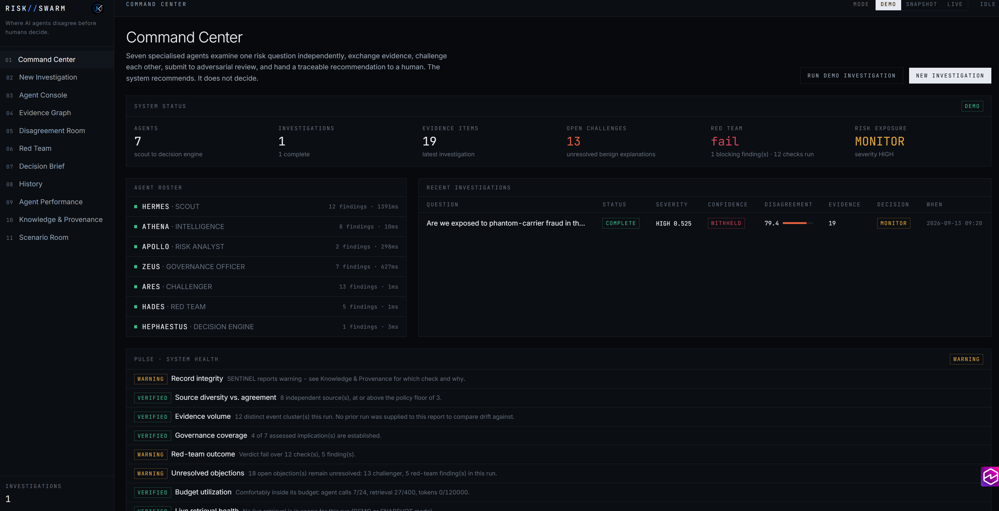
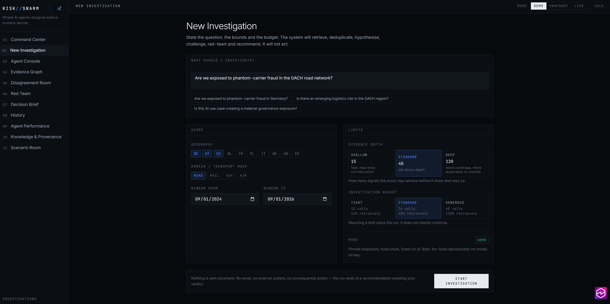
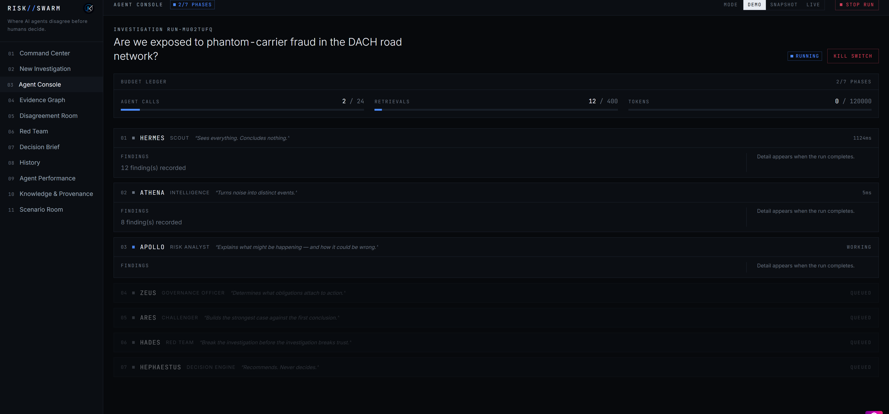
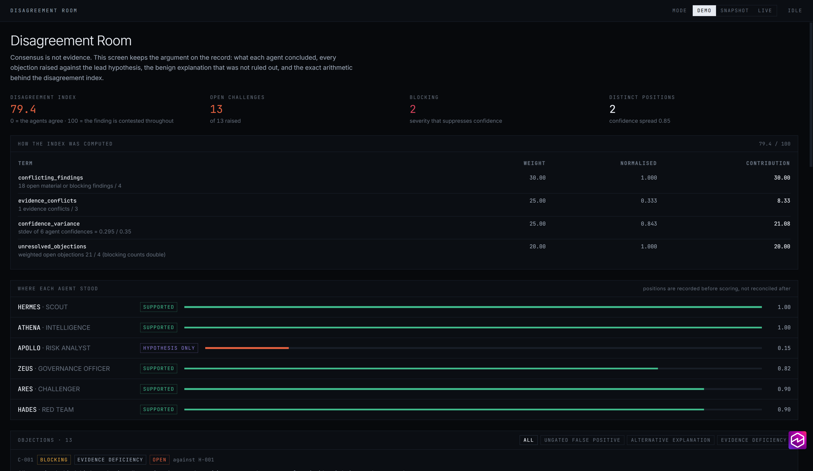
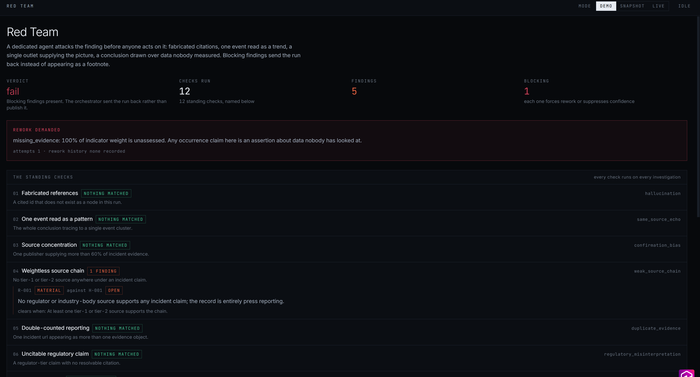
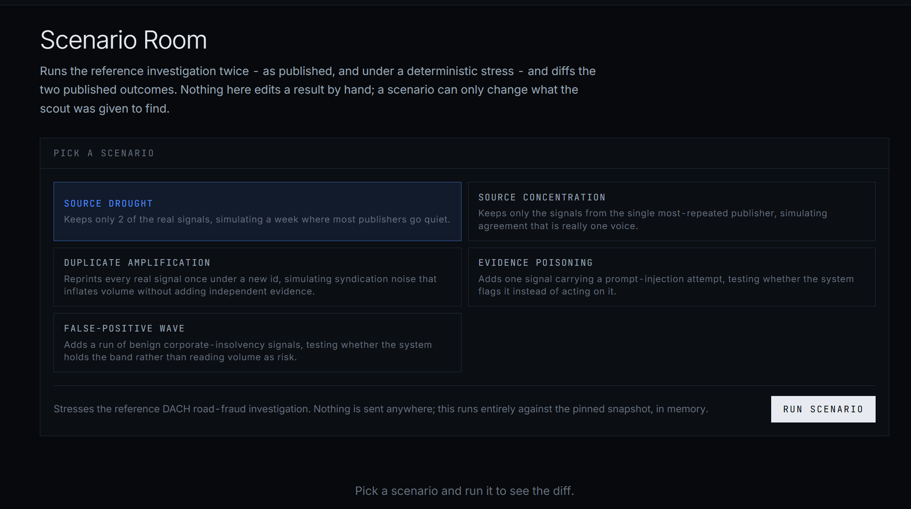
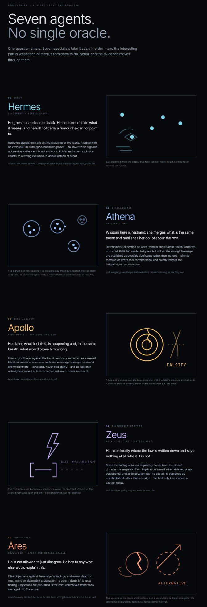

<p align="center"></p>

<div align="center">

```
██████╗ ██╗███████╗██╗  ██╗    ██╗ ██╗███████╗██╗    ██╗ █████╗ ██████╗ ███╗   ███╗
██╔══██╗██║██╔════╝██║ ██╔╝   ██╔╝██╔╝██╔════╝██║    ██║██╔══██╗██╔══██╗████╗ ████║
██████╔╝██║███████╗█████╔╝   ██╔╝██╔╝ ███████╗██║ █╗ ██║███████║██████╔╝██╔████╔██║
██╔══██╗██║╚════██║██╔═██╗  ██╔╝██╔╝  ╚════██║██║███╗██║██╔══██║██╔══██╗██║╚██╔╝██║
██║  ██║██║███████║██║  ██╗██╔╝██╔╝   ███████║╚███╔███╔╝██║  ██║██║  ██║██║ ╚═╝ ██║
╚═╝  ╚═╝╚═╝╚══════╝╚═╝  ╚═╝╚═╝ ╚═╝    ╚══════╝ ╚══╝╚══╝ ╚═╝  ╚═╝╚═╝  ╚═╝╚═╝     ╚═╝
                                                                                   
```

### WHERE AI AGENTS DISAGREE BEFORE HUMANS DECIDE

*Seven agents investigate, challenge each other, and hand a traceable recommendation to a human*


<table>
<tr><td align="center">🧠</td><td align="center">🏛️</td><td align="center">⚔️</td><td align="center">👁️</td></tr>
<tr>
<td align="center"><a href="https://jeevan-0508.github.io/risk-swarm/"><b>LIVE DEMO</b></a></td>
<td align="center"><a href="#the-seven-agents"><b>THE SEVEN AGENTS</b></a></td>
<td align="center"><a href="#the-adversarial-suite"><b>ADVERSARIAL SUITE</b></a></td>
<td align="center"><a href="#where-to-watch-the-agents-work"><b>WATCH THEM WORK</b></a></td>
</tr>
<tr><td align="center">Run an investigation</td><td align="center">Who does what</td><td align="center">30 attacks</td><td align="center">Screen by screen</td></tr>
</table>

</div>

**Where AI agents disagree before humans decide.**

Most "AI risk" tools produce one confident answer. That is the failure mode, not the feature: a single
confident answer hides the evidence it rests on, buries the benign explanation that fits the same facts,
and gives a human nothing to push back on.

RISK//SWARM runs seven agents over the same question and **keeps their disagreement in the output**. Every
claim carries the evidence it rests on. A red team attacks the investigation itself. The scorer publishes
which requirement it failed and why the recommendation was held back. A human decides at the end.

It runs with **no API key, no network and no paid service**. The demo below is reproducible byte for byte.

**[Open the live demo](https://jeevan-0508.github.io/risk-swarm/)** — fourteen screens, no sign-in, no backend.

---

## Screenshots

Captured from the live demo, DEMO mode, one reproducible run of the reference DACH road-fraud question.

| | |
|---|---|
|  |  |
| **Command Center** — seven agents, one complete run. Disagreement index 79.4, red team **fail**, exposure MONITOR, confidence **withheld**. PULSE health checks below. | **New Investigation** — the question, geography and date bounds, evidence depth, budget. Reaching a limit stops the run; it does not silently continue. |
|  |  |
| **Agent Console**, mid-run — phase 2 of 7, budget ledger counting calls and retrievals, and each agent's constraint printed beside it. | **Disagreement Room** — the index computed term by term, and where each agent stood. APOLLO held at *hypothesis only* while five others supported. |
|  |  |
| **Red Team** — verdict fail. 12 standing checks, 5 findings, 1 blocking: the run went back instead of publishing. | **Scenario Room** — five deterministic stresses. A scenario can only change what the scout was given to find. |

[](https://jeevan-0508.github.io/risk-swarm/#/pantheon)

**Pantheon** — the seven agents as the gods they are named after, each next to the thing it is forbidden to do.

---

## The seven agents

| Agent | Job | Cannot |
|---|---|---|
| **SCOUT** | Retrieves external signals, one evidence object per signal | Interpret, rank or conclude. A signal with no verifiable URL is dropped, not downgraded |
| **INTELLIGENCE** | Deduplicates: makes one event reported five times count once | Use a model at all. Every number is deterministic arithmetic you can audit line by line |
| **RISK ANALYST** | Turns observations into hypotheses, each with a mandatory falsification test | Reach "supported" while the operational indicators are unassessed |
| **GOVERNANCE OFFICER** | Maps the obligations that attach to *acting on this with an automated system* | Evidence an incident. Its citations are tier 1 but flagged `incident_claim: false` |
| **CHALLENGER** | Argues the benign case from the taxonomy's own documented false positives | Be talked out of an objection. Every challenge names a fact in the record |
| **RED TEAM** | Attacks the investigation, not the risk: 12 standing checks | Ever *create* an escalation. A `fail` can only stop one |
| **DECISION ENGINE** | Assembles the recommendation, its gates and its actions | Decide on its own authority. `decided_by` stays `system_recommendation` until a human records a verdict |

---

## Where to watch the agents work

Everything each agent did is inspectable, not hidden behind a chat log.

```bash
bun run scripts/demo-run.ts     # the whole investigation, printed
```

| What you want to see | Where it is |
|---|---|
| Which agent ran, in what order, how long, how many findings | `result.log` — one `PhaseLogEntry` per phase, printed as the `agents` line |
| Everything one agent produced, including what it was unsure about | `result.outputs.<agent>` — `findings`, `uncertainties`, `reasoning_status`, `cost` |
| Who created any given node | every node carries `created_by`, and `result.graph.toJSON()` dumps all of them |
| What the recommendation actually rests on | `result.graph.evidenceChain(decisionId)` — the only sanctioned way to ask |
| Why the band is not higher | `decision.gates_failed` and `decision.caps_applied`, both printed |
| What it cost and whether it was stopped | `result.spent` (agent calls / retrievals / tokens) and `result.attempts` |
| Whether an agent was allowed to phrase something with a model | `degraded_reason` on the agent output; absent means deterministic wording |
| That the behaviour is enforced, not described | `bun test` — 643 tests across 49 files, 30 of them adversarial attacks |

The same record drives the UI. The browser build is a **pure renderer** over `RunResult`: no screen
recomputes a number, because a figure computed twice is a figure that can disagree with itself.

| Screen | What it is for |
|---|---|
| 01 Command Center | The last run's answer, its gates and the mode in force |
| 02 New Investigation | Question, scope, depth and budget — set before the run, not raised mid-flight |
| 03 Agent Console | Each phase as it really completes, with findings, uncertainties and cost |
| 04 Evidence Graph | The append-only graph, layered by node kind; click any node for its evidence chain |
| 05 Disagreement Room | The disagreement index with all four terms and their arithmetic, and every objection |
| 06 Red Team | The 12 named checks, which fired, and which findings could not be cleared |
| 07 Decision Brief | One page a human can act on, plus the markdown export and the human verdict |
| 08 History | Past runs, restored from browser storage, each still carrying its own graph — open any one as a case file |
| 09 Agent Performance | Cost and output per agent, the outcome recorder, and the lesson ledger |
| 10 Knowledge & Provenance | Snapshot hashes, the tier ladder, and what LIVE retrieval actually fetched |
| 11 Scenario Room | Five stress scenarios run against the pinned baseline, and the diff between them |
| 08a Case File | One run in full — asked and answered times, timeline, agent-by-agent, who disagreed, final result; downloadable as HTML, Word, markdown, JSON or a printed PDF |
| 12 Internal Knowledge | What the system already holds, searched over the committed index, before it retrieves anything |
| 13 Research | Live retrieval from eight keyless public providers: the plan, every attempt including the failures, and each provider's own reason |
| 14 Knowledge Delta | The human gate on the taxonomy itself — validate a proposed category, approve it with a name or reject it with a reason |
| 15 Model Configuration | EVOLUTION 6.0 — assign real providers/models to ATHENA/ARES/HADES/ZEUS, bring your own API key, browser-only, see model diversity |
| The Council | The deliberation transcript for the loaded run: seven seats on a ring, who asked whom what, replay, an agent inspector, the decision lineage, and a command bar that refuses rather than improvises |

---

## The demo, unedited

A 24-month DACH road-freight window over 874 real signals:

```
Are we exposed to phantom-carrier fraud in the DACH road network?

recommendation         MONITOR  (severity HIGH 0.525, urgency ELEVATED)
confidence             withheld - 3 unresolved blocking finding(s): no confidence figure is
                       published while the investigation is contested
disagreement index     79.4
graph                  64 nodes, 97 edges, intact true, cycles 0
agents                 discover:12 deduplicate:8 analyse:2 govern:7 challenge:13 red_team:5 decide:1
budget spent           7 agent calls, 27 retrievals, 0 tokens

why:
  - 12 incident-claim evidence object(s) reduce to 12 distinct event cluster(s) across
    8 independent publisher(s).
  - The link to Phantom Carrier (FFT-002) is a lexical topic match on "fake-frachtführer";
    it evidences discussion of the pattern, not its occurrence here.
  - 9 of 9 operational indicator(s) are unassessed (completeness 0%), so occurrence is
    untested rather than disproved.
  - 5 of 5 documented false-positive gate(s) remain open, and each one is a benign
    explanation that fits the same evidence.

unmet escalation requirements:
  - unresolved blocking finding(s): escalation withheld
  - confidence withheld below 0.6
  - false-positive risk 0.41 at or above 0.4
  - no tier-1 or tier-2 source supports the incident claim
```

**This is the point of the project.** 874 signals, one genuine carrier-fraud report from a single
publisher, no internal operational data — the honest output is *monitor and investigate*, with the
better-evidenced adjacent risk being insolvency-driven carrier substitution (58% of the surviving
signals are insolvency events). A system that answered "CRITICAL — escalate" here would be flattering
itself, and you would learn to ignore it by the third false alarm.

---

## How it refuses to flatter itself

These are enforced in code and covered by tests, not stated as intentions.

- **Reasoning is not evidence.** Source tiers weigh 1.0 / 0.8 / 0.55 / 0.7 and **tier 5 (model
  reasoning) weighs 0.00**. An all-tier-5 chain scores zero confidence.
- **Repetition cannot manufacture certainty.** Confidence is computed over evidence *clusters* and
  source tiers, never over how many agents agree. Ten articles about one event count once.
- **Independence means independent *incident* reporting.** A regulator citation is tier 1 and belongs in
  the record, but it can never make an event independently reported — otherwise the governance officer
  could satisfy the escalation gate by citing more law.
- **`unknown` is never folded into `absent`.** An unassessed indicator is an evidence gap; treating it as
  a clean result is how a coverage score becomes a fraud probability.
- **A hypothesis with no falsification test is invalid** — the schema rejects it.
- **Near-duplicates that fall short of the merge threshold are published, not merged.** Silently merging
  destroys real corroboration; failing to merge inflates independence. So the ambiguous pairs are printed
  and the red team may challenge the count.
- **Confidence is withheld, not lowered, while a blocking objection stands.** No number is published on a
  contested investigation.
- **A lesson may only tighten.** The learning loop's policy deltas throw `PolicyDeltaRejected` on any
  attempt to lower a gate, so a bad outcome cannot be used to poison the scorer.
- **Retrieved text is data, never instruction.** Eight injection patterns are detected, fences are
  neutralised, and a suspected item's weight is halved. A model may only re-word a structure the agent
  already built and validated, and may cite only the evidence ids it was handed —
  `FabricatedCitationError` otherwise.
- **The band is the highest rung whose requirements are met**, not one demotion per failed gate. Four
  ordinary shortfalls should not collapse a real multi-publisher signal to "nothing to see".
- **A stored run that no longer validates is dropped, never repaired.** A tampered record fails the
  schema and disappears; it is not coerced into something plausible.
- **The UI recomputes nothing.** Every figure on every screen is read from the run record, so the screens
  and the audit trail cannot drift apart.
- **Rework is only for construction defects** — a fabricated id, a circular chain, an untestable
  hypothesis. A defect in the *evidence that exists* (one publisher, no internal data) is published and
  caps the band, because re-running cannot conjure evidence.

---

## The Council: watching the disagreement happen

Screen 12, `/council`, is the deliberation itself — not a summary of it. Seven seats on a ring, and the
exchange between them read one at a time: who asked whom what, which objection was filed against which
hypothesis, what was answered, what was revised, and what is still open at the end.

**Every exchange is a real structured event.** `core/deliberation/coordinator.ts` synthesises the
transcript from an already-completed run's own agent output — each event resolves to a real challenger
finding, a real red-team finding, a real recorded agent position, a real `recommended_next_step` or a real
evidence reference, and every id it cites is filtered against the graph before the event is written. There
is no model call in it, no clock and no randomness, so the same run produces the identical transcript
twice, byte for byte.

**The UI cannot invent one.** Nothing under `src/council` imports the coordinator, and `DeliberationEvent`
is imported there only as a type — so no council module can parse an object into an event, and no event
literal exists in the folder. Replay is a pure function over the stored array whose entire dependency list
is a single `import type`: watching a deliberation back is reading a record, not re-enacting it.

**It never forces agreement.** The session ends in one of `CONSENSUS`, `QUALIFIED_CONSENSUS`,
`MATERIAL_DISAGREEMENT`, `UNRESOLVED` or `LIMIT_REACHED`, narrating the disagreement index `scoring/score.ts`
already computed rather than recomputing it. Three budgets (`max_events`/`max_rounds`/`max_agent_responses`)
are hard stops, and a budget that cuts the session short says `LIMIT_REACHED` in a terminal event rather
than falling silent in a way that would read as agreement.

| On the screen | What it is |
|---|---|
| Council Core | The seven seats, lit by whoever speaks at the cursor. A beam is drawn only when a real event names both a speaker and an addressee. A seat that has not spoken is present but unlit — never hidden |
| Live Deliberation | The transcript in `sequence` order, with the type, status, and evidence and claim counts of each exchange. Filterable by seat |
| Replay | Play/pause at 1x/2x/4x over the stored events. Speed changes pacing only; it can never skip an exchange, and the cursor clamps at the end rather than looping |
| Agent Inspector | One seat's remit, the position it recorded in the score, its own uncertainties verbatim — and what it structurally **cannot** do |
| Decision Lineage | Decision → hypothesis → observation → evidence, plus source concentration and, ranked by weight, the indicators nobody has assessed yet |
| Decision Core | The band, the outcome, and a link to screen 07. The recommendation is rendered once, by the brief, so the two can never disagree |
| Command bar | 15 read commands over the run's own stored data. Anything else answers `Capability unavailable.` — there is no branch that improvises |

On the pinned demo run the council produces **41 exchanges over 8 rounds** and ends in
`MATERIAL_DISAGREEMENT` — eight of the twelve event types appear, because four of them have nothing to
fire on in that particular run (see the limitation below).

Sound is original, off by default, and carries nothing that is not also written on screen. Motion is
decoration: with `prefers-reduced-motion` every animation stops and no information is lost. Below `sm` the
ring becomes a column — the same seven seats and the same states, re-laid out rather than reduced.


## Three modes, and what changes between them

| Mode | Knowledge | Clock | Reproducible |
|---|---|---|---|
| **DEMO** | pinned snapshots | fixed instant, fixed run id | byte for byte |
| **SNAPSHOT** | pinned snapshots | real clock | same knowledge, live timing |
| **LIVE** | public feeds for discovery; taxonomy and governance stay pinned | real clock | no — and it says so |

LIVE changes discovery and nothing else. Tier still follows source type, so a live item can add evidence
but can never promote it. A browser cannot read a feed that forbids cross-origin access, and a feed that
could not be read is listed on the provenance screen with its reason — never substituted with a
plausible item. Lessons are excluded in DEMO mode so the reproducible run stays reproducible.

---

## The learning loop, and why it cannot be poisoned

A human records what actually happened. Only a **false positive** produces a lesson, and a lesson may
only **tighten** a gate for the pattern it was learned on:

- a *correct* outcome proposes nothing — being right is not evidence the gates are too strict;
- a *false negative* proposes nothing either, because the only change that would have caught it is a
  looser gate, and a run of planted misses would otherwise train the system into recklessness;
- the delta schema cannot even express a looser gate, and `applyPolicyDelta` throws
  `PolicyDeltaRejected` on one handed in past the type;
- every lesson expires after a stated number of runs, and rejected lessons stay visible in the ledger.

---

## The adversarial suite

`src/core/adversarial/attacks.test.ts` holds 16 attacks on the guards rather than tests of the features.
Each one tries to make the system say something it cannot support: instructions hidden in retrieved text,
a fence breaker, a pile-on from one publisher wearing many names, one event syndicated to look like a
trend, an aggregator posing as the publisher, a caller supplying its own tier, a lesson that loosens a
gate, a success story used to argue for less scrutiny, an expired lesson, an edit to the graph after the
fact, a tampered stored run, an escalation demanded without operational evidence, an empty world fished
for a verdict, a red team that can never be satisfied, and a run pushed past its budget.

`src/core/deliberation/adversarial.test.ts` adds 14 more, aimed at the Council: a fabricated citation
inside the transcript (blocked by name), an evidence id no agent ever cited, a single altered character in
a sealed event, a mutation laundered through a persistence round trip, every open exchange flipped to
resolved with the outcome rewritten to `CONSENSUS`, a UI asked to author an event, each of the three
deliberation budgets exhausted individually, and a narration asked to move the band.

---

## Knowledge sources

The agents do not browse. They read **pinned, hash-verified snapshots** (3 sources, 4 files) of my own
repositories, so a run is reproducible and provenance is checkable. A fourth repo is the export target.

| Source | What it provides | Verified counts |
|---|---|---|
| [FOMO](https://github.com/Jeevan-0508/FOMO) | The signal feed SCOUT retrieves from | 874 signals |
| [freight-risk-atlas](https://github.com/Jeevan-0508/freight-risk-atlas) / [freight-fraud-taxonomy](https://github.com/Jeevan-0508/freight-fraud-taxonomy) | The RISK ANALYST's pattern base | 12 patterns, 77 indicators, 31 documented false positives, 137 countermeasures |
| [ai-governance-control-room](https://github.com/Jeevan-0508/ai-governance-control-room) | The GOVERNANCE OFFICER's frameworks | 4 frameworks, 56 requirements, 29 controls |
| [risk-os](https://github.com/Jeevan-0508/risk-os) | Export sink — a decision leaves as an import-shaped risk candidate | no snapshot needed |

`public/snapshots/provenance.json` records the upstream commit and a sha256 for every file.
`bun run snapshot:check` fails if a snapshot has drifted from its recorded hash.

Upstream `category` and `severity` labels are **distrusted on principle**: the adapter re-derives the
category by keyword and reports a `category_disagreement` rather than accepting the label. That check was
added because the upstream feed matches news by OR'd keywords, so its own labels are unreliable.

---

## Run it

```bash
bun install
bun run scripts/demo-run.ts        # the full investigation, no key, no network
bun run dev                        # the fourteen screens at /risk-swarm/
bun test                           # 643 tests, 49 files
./node_modules/.bin/tsc -b --noEmit # typecheck
bun run snapshot:check              # verify snapshots against their recorded hashes
```

Requires [bun](https://bun.sh). There is no backend and no database: the engine is framework-free
TypeScript with zod as the single source of truth for every node shape.

## Repo map

```
src/core/domain/       zod model, append-only risk graph, id factory, node minter
src/core/ingest/       untrusted-input boundary: injection detection, source identity
src/core/intel/        deterministic clustering, possible-duplicate reporting, recurrence buckets
src/core/integrations/ one adapter per knowledge source, behind a snapshot-loader seam
src/core/scoring/      ten factors, disagreement index, hard caps, requirement ladder, tighten-only policy
src/core/reasoner/     the model seam: deterministic default, optional BYO-key LLM
src/core/agents/       the seven agents, plus the reproducible harness (budget + kill switch)
src/core/orchestrator/ fixed phase order, graph assembly, bounded rework
src/core/sources/      LIVE retrieval: feed parsing, content hashing, an operator-configured registry
src/core/learning/     outcomes and tighten-only lessons
src/core/persistence/  versioned run records; a record that fails validation is dropped
src/core/brief/        the markdown decision brief
src/core/deliberation/ the Council's deterministic coordinator: a synthesis over a completed run
src/core/lineage/      decision lineage, evidence still needed, source concentration
src/core/adversarial/  16 attacks on the guards
src/core/question/     open-domain question routing: intent, domain, freshness, depth
src/core/packs/        knowledge packs - the freight taxonomy, and an open pack that carries none
src/core/research/     the research plan, the provider registry, retrieval, normalization
src/core/knowledge/    the internal index, the research ledger, the taxonomy approval gate
src/app/               the fourteen screens: a pure renderer over the run record
src/visual/            the console's visual vocabulary: state, tokens, geometry, integrity rings
src/council/           the deliberation chamber, in its own lazy chunk and stylesheet
docs/                  architecture, domain model, agent contracts, scoring, integrations, test strategy
```

---

## Beyond freight

The engine started as a freight-risk system, and for a while the form said so: a question could not be
asked without a country list and a transport mode. That was a vocabulary problem wearing the costume of a
domain boundary, and it is gone.

- **A question routes itself.** `src/core/question/` reads intent, domain, freshness need and depth from
  the question text. Geography and mode are optional, and an empty scope means *no filter* rather than
  *match nothing*.
- **Knowledge is a pack, not a constant.** Two ship: the freight pack (the taxonomy, controls, geography
  and mode vocabularies the pipeline always used, referenced rather than restated) and an **open pack**
  that carries no taxonomy and no control set and says so. Under the open pack the risk analyst and the
  governance officer **stand down** instead of producing an empty shape — 5 agents participate, 2 abstain,
  and the screen names them before the run.
- **The recommended pack is scored, not looked up.** Every pack is scored against *its own*
  `relevance_terms`, whole-word. A pack with no vocabulary is reported as unscorable, never as a zero.
- **Retrieval is real, and separate.** Screen 13 reaches eight keyless public providers (Wikipedia,
  Wikidata, OpenAlex, Crossref, Hacker News, World Bank, DuckDuckGo, news RSS). One of the eight cannot be
  read cross-origin from a static host, so it is marked proxy-only and stays off unless you switch a reader
  proxy on and accept the trust cost, stated on the screen. Every attempt is printed, including the
  failures, with the provider's own reason.
- **Research never enters a reproducible run.** `investigate()` is byte-for-byte reproducible and a live
  network cannot live inside that, so retrieval is its own screen and its own act. Nothing it fetches
  rewrites a stored run.
- **The system searches itself first.** Screen 12 searches a committed index of this repository's own
  taxonomy, controls and documentation — 156 records over 13 sources — and prints each hit's path, byte
  count and sha256.
- **The taxonomy has a door with a person behind it.** A research pass may *propose* a category
  (`KnowledgeDelta`); nothing is knowledge until screen 14 validates it and a named human approves it, with
  at least two distinct sources, because one source repeated is the same claim twice.

## Honest limitations

- **No internal operational data.** Every operational indicator is `unknown`, so the system can evidence
  that a pattern is *discussed* and never that it *occurred*. Supply indicator states and the analysis
  gets sharper; the demo deliberately does not.
- **Lexical pattern matching.** A pattern nobody named in a headline is invisible to this method.
- **The signal feed is news.** News coverage rises when journalists notice something, which is not the
  same as the underlying rate rising. The challenger says so on every run.
- **Framework summaries are plain-language paraphrases**, not legal text, and none of this is legal advice.
- **A red-team pass means "no known defect"**, not "sound". 12 checks run; a weakness outside them passes
  unnoticed.
- **History lives in browser storage.** It is per-browser and per-device, and it is cleared with the
  screen's own discard button. There is no server, so there is nowhere else for it to live.
- **The Council is a synthesis, not a live argument.** The transcript is generated in one deterministic
  pass over a run that has already finished — the agents did not take turns in real time, and the screen
  does not pretend they did (every event carries the run's own completion instant, and `sequence`, not a
  fabricated clock, is the ordering). Two event types, DEFENSE and REBUTTAL, are wired and tested but
  **structurally dormant**: nothing in the pipeline today ever moves an objection off `open`, so nothing
  today defends against one. Two more, REVISION and ESCALATION, are run-dependent rather than dormant —
  they fire when the analyst really superseded a hypothesis and when the band really is `ESCALATE`, and
  the demo run does neither.
- **LIVE mode is limited by the browser.** Many feeds refuse cross-origin reads from a static host. The
  system reports each refusal instead of working around it.
- **An approval on screen 14 lasts the session.** `approveProposal` returns a *new* pack; the pinned
  snapshot on disk is untouched, because a static page has nowhere to write. The screen says so and hands
  back the approved rule as JSON for a human to commit.
- **The research pipeline retrieves, it does not read.** It normalizes titles, excerpts, dates, source
  identity and hashes. It does not fetch article bodies and it does not summarise, so an excerpt is the
  source's own words or nothing.
- **The console's visuals have never been checked in a browser by the author of this code.** Every screen
  is typechecked, built and covered by tests that render or read the markup, but the arcs, lanes and rings
  of the console layer have not been eyeballed at a real viewport. Layout bugs are possible and would be
  invisible to the suite.

## Licence

MIT. Built by [Jeevan Siddhabhaktula](https://github.com/Jeevan-0508).
